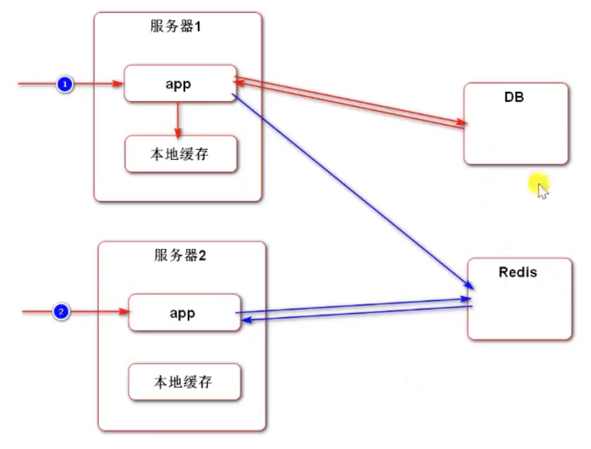

##本地缓存和分布式缓存redis
+ 
---
    本地缓存：
            用户第一次发送请求,请求分发到服务器1上，先在本地缓存中查找相关数据,查不到再去访问DB,   
        再将用户相关信息(如登录凭证)存到本地缓存中。   
            当用户发送第二次请求的时候,请求分发到服务器2上,从本地缓存中查找用户相关信息,  
        此时服务器2的本地缓存中并没有用户相关信息,因此请求被拒绝。
            可以看出本地缓存不适合缓存用户强相关的信息。
    redis：
            redis可以被两台服务器共同访问,其中的缓存是被共享的,因此不存在本地缓存的问题。
    
+ 本地缓存的效率要比redis高(因为和应用在同一台服务器上)
+ redis的适用范围比本地缓存广

    
