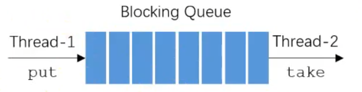

##阻塞队列
+ BlockingQueue 
  + 解决线程通信的问题
  + 阻塞方法：put、take
    
    ---
    
    ---
    Thread1相当于生产者，Thread2相当于消费者
    BlockingQueue就是两线程通信的桥梁（缓冲的空间），避免直接打交道。  
    (若直接打交道)生产者生产速度远大于消费速度，生产者一直在生产占用CPU资源，没有被阻塞。反之同理。  
    当队列满的时候，生产者就被阻塞。队列为空时，消费者被阻塞。  
##使用kafka发送系统通知
+ 评论后，发布通知
+ 点赞后，发布通知
+ 关注后，发布通知